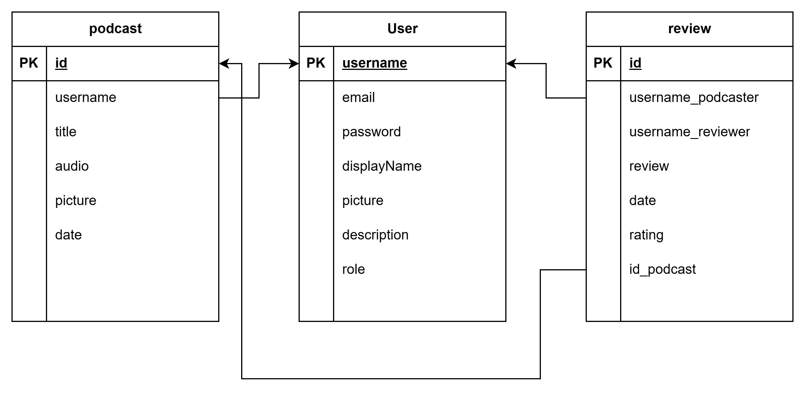

# REST Service
### Tugas Besar 2 IF3110

### Deskripsi REST Service
REST service ini digunakan dalam pengelolaan fitur podcast. Selain itu, service ini juga menangani autentikasi pengguna (podcaster dan admin), fitur feedback, dan fitur pengelolaan podcast. Service ini dibuat dengan menggunakan NodeTS. 

### Skema Basis Data

### Daftar Requirement
Berikut merupakan daftar requirements untuk aplikasi:
1. npm
2. typescript
3. prisma
4. postgres
5. jwt
6. node express

### Cara Instalasi
1. Lakukan instalasi requirements tersedia
2. Clone repository
3. Lakukan clone pada repository ini
4. Jalankan aplikasi docker
5. `docker-compose up --build` pada terminal
6. `npx prisma migrate dev` pada terminal container prisma-postgres-api pada docker
6. Lanjutkan dengan `npx prisma generate`
7. `npx prisma db seed` untuk membuat data awal

### Endpoint API
| Method        | Endpoint           | Fungsi  |
| --- |---| ---|
| POST | /user/register | registrasi akun podcaster |
| POST| /user/login |   autentikasi pengguna |
| PUT | /user/:username  |  memperbarui data podcaster |
| DELETE| /user/:username | menghapus akun podcaster |
| GET| /user | mendapatkan seluruh data user untuk testing |
| GET| /user/podcaster | mendapatkan seluruh data podcaster untuk ditampilkan pada podcast page php|
| GET| /user/getDataPodcaster/:username |  mendapatkan data podcaster beserta podcast yang dimiliki podcaster|
| POST| /podcast| menambah podcast baru |
| GET| /podcast| mendapatkan seluruh data podcast untuk testing |
| GET|  /podcast/:podcaster|  mendapatkan data podcast seorang podcaster|
| PUT| /podcast/:id | memperbarui data podcast|
| DELETE| /podcast/:id| menghapus data podcast|
| GET| /review/:username| mendapatkan review podcaster|
| GET| /review| mendapatkan seluruh review untuk testing|
| POST| /review| menambahkan review baru|
| POST| /upload/audio| untuk mengupload file audio|
| POST| /upload/cover| untuk mengupload file cover|
| POST| /upload/profile| untuk mengupload file profile picture|

### Pembagian Tugas
- REST
    - Database: 13521120
    - Docker: 13521120
    - Autentikasi pengguna: 13521120
    - Endpoint user: 13521168
    - Endpoint upload: 13521120
    - Endpoint podcast: 13521120
    - Endpoint review: 13521050
    - Endpoint subs: 13521050
    - Soap utils: 13521050

### Kelompok 37:
- 13521050 Naufal Syifa Firdaus
- 13521120 Febryan Arota Hia
- 13521168 Satria Octavianus Nababan